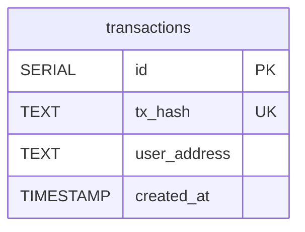

# Database Schema Documentation

This document describes the database schema for the Transactions Server. The schema uses PostgreSQL and is managed through migrations located in `src/migrations/`.

## Database Schema Diagram

## Tables Overview

The database contains one main table:

1. **`transactions`** - Stores all relayed meta-transactions with their hashes, user addresses, and creation timestamps

## Table: `transactions`

Stores all meta-transactions that have been relayed through the service. This table maintains a complete history of all transactions processed, enabling transaction lookup by user address and providing an audit trail.

### Columns

| Column         | Type      | Nullable | Description                                                                      |
| -------------- | --------- | -------- | -------------------------------------------------------------------------------- |
| `id`           | SERIAL    | NOT NULL | **Primary Key**. Auto-incrementing unique identifier for each transaction record |
| `tx_hash`      | TEXT      | NOT NULL | **Unique**. The blockchain transaction hash returned by the relayer provider     |
| `user_address` | TEXT      | NOT NULL | Ethereum address of the user who initiated the transaction                       |
| `created_at`   | TIMESTAMP | NOT NULL | Timestamp when the transaction was relayed. Defaults to current timestamp        |

### Indexes

- **Primary Key**: `id` (auto-incrementing serial)
- **Unique Constraint**: `tx_hash` - ensures no duplicate transaction hashes are stored

### Constraints

- **Transaction Hash Uniqueness**: The `tx_hash` column must be unique to prevent duplicate transaction records
- **Non-null Values**: All columns are required and cannot be null

### Business Rules

- **Address Normalization**: User addresses are normalized to lowercase before insertion to ensure consistency
- **Transaction Immutability**: Once a transaction is recorded, it should not be modified (append-only pattern)
- **Timestamp Auto-generation**: The `created_at` field automatically captures the current timestamp when a record is inserted
